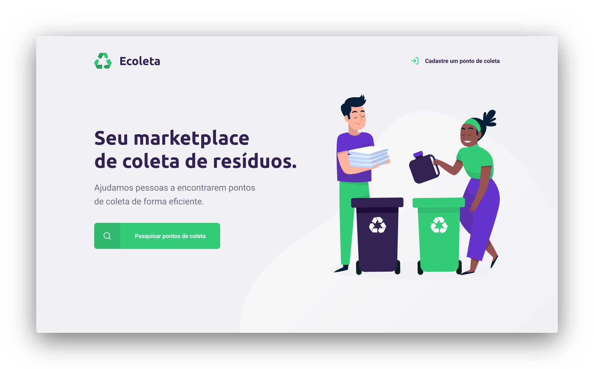
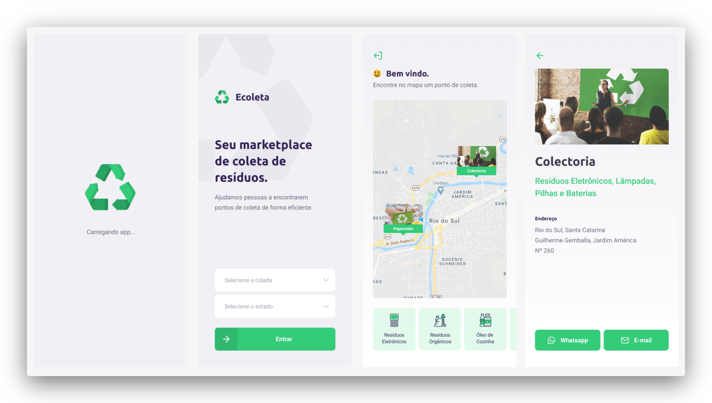

<h1 align="center">
    
    <br>
</h1>

<p align="center">
  <a href="https://rocketseat.com.br">
    
  </a>
    
</p>


<h4 align="center">
  <p>Seu ponto de coleta de lixo está aqui!</p>
  
  <p>Esta aplicação foi baseada na Semana do Próximo Nível # 01 da Rocketseat.</p>

  <p>A idéia principal é ajudar as pessoas a encontrar pontos de coleta de resíduos de maneira eficiente.</p>
</h4>


<p align="center">
  <a href="#rocket-tecnologias">Tecnologias</a>&nbsp;&nbsp;&nbsp;|&nbsp;&nbsp;&nbsp;
  <a href="#information_source">Como Usar</a>&nbsp;&nbsp;&nbsp;|&nbsp;&nbsp;&nbsp;
  <a href="#thumbsup">Como Contribuir</a>&nbsp;&nbsp;&nbsp;|&nbsp;&nbsp;&nbsp;
  <a href="#memo-licença">Licença</a>
</p>

<p align="center">
  
  
</p>

## :rocket: Tecnologias

Este projeto foi desenvolvido com as seguintes tecnologias:

-  [Node](https://nodejs.org/en/docs/)
-  [Express](https://expressjs.com/pt-br/)
-  [Cors](https://www.npmjs.com/package/cors)
-  [Knex](https://knexjs.org/)
-  [SQLite](https://www.sqlite.org/version3.html)
-  [React](https://reactjs.org/docs/getting-started.html)
-  [React Icons](https://react-icons.github.io/react-icons/)
-  [React Leaflet](https://react-leaflet.js.org/docs/en/installation)
-  [Axios](https://www.npmjs.com/package/axios)
-  [Sweet Alert](https://sweetalert2.github.io/)
-  [Expo](https://docs.expo.io/)
-  [React Navigation](https://reactnavigation.org/)
-  [React Native Gesture Handler](https://kmagiera.github.io/react-native-gesture-handler/)
-  [React Native Maps](https://www.npmjs.com/package/react-native-maps)
-  [React Native SVG](https://www.npmjs.com/package/react-native-svg)
-  [React Native Picker Select](https://www.npmjs.com/package/react-native-picker-select)
-  [Mail Composer](https://docs.expo.io/versions/latest/sdk/mail-composer/)
-  [Constants](https://docs.expo.io/versions/latest/sdk/constants/)
-  [VS Code][vc]

## :information_source: Como Usar

Para clonar e executar este aplicativo, você precisará [Git](https://git-scm.com), [Node.js][nodejs] + [Yarn][yarn] instalado no seu computador.

Na sua linha de comando:

### Instalar Dependências

```bash
# Clonar este repositório
$ git clone https://github.com/carlosferreira01/next-level-week-01.git

# Entre no repositório
$ cd next-level-week-01

# Instalar dependências
$ npm install

```

### Instalação da API

```bash
# Mova-se para a pasta server
$ cd ..
$ cd server

# Execute migrates
$ npm knex:migrate

# Execute seeds
$ npm knex:seed

# Iniciar servidor
$ npm dev

# Agora o servidor está sendo executado na port:3333 - Para acessá-lo, vá para http://localhost:3333 
 
```

### Iniciar Aplicação Web

```bash
# Mova-se para a pasta da web
$ cd ..
$ cd web

# Executar Aplicação
$ yarn start

# O aplicativo da web será aberto na port:3000 - Para acessá-lo, vá para http://localhost:3000 
```

### Iniciar Aplicação Mobile

```bash
# Mova-se para a pasta mobile
$ cd ..
$ cd mobile

# Executar Aplicação 
$ yarn start

# A Expo será aberta, basta digitalizar o qrcode no terminal ou na página da exposição
# Além disso, você pode executar no Xcode ou no Android Studio, se tiver algum deles

# Se houver algum problema com as fontes, execute:
$ expo install expo-font @expo-google-fonts/ubuntu @expo-google-fonts/roboto

```

## :thumbsup: Como Contribuir

-  Faça um fork;
-  Crie uma branch com sua feature: `git checkout -b my-feature`;
-  Commit cas mudançEste projeto está sob aas: `git commit -m 'feat: My new feature'`;
-  Faça um push para sua branch: `git push origin my-feature`.

Depois de mesclar sua solicitação de recebimento, você pode excluir uma filial da sua.

## :memo: Licença
Este projeto está sob a MIT license. Veja o [LICENSE](https://github.com/carlosferreira01/next-level-week-01/blob/master/LICENSE) para maiores informações.

---
<h4 align="center">
    Made with ♥ by Carlos Ferreira 👋 <a href="https://www.linkedin.com/in/carlos-edu-ferreira/" target="_blank">Entrar em contato!</a>
</h4>

[nodejs]: https://nodejs.org/
[yarn]: https://yarnpkg.com/
[vc]: https://code.visualstudio.com/
[vceditconfig]: https://marketplace.visualstudio.com/items?itemName=EditorConfig.EditorConfig
[vceslint]: https://marketplace.visualstudio.com/items?itemName=dbaeumer.vscode-eslint

